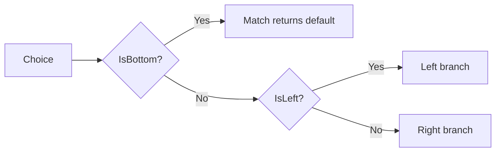

# Diagramas (Mermaid)

## Result<TEntity>

```mermaid
flowchart LR
    A[Result<TEntity>] --> B{IsSuccess?}
    B -->|Yes| C[Value (_value)]
    B -->|No| D[BaseError (_error)]
    C --> E[Map / Bind / Then / Match]
    D --> F[Else / Match]
```

## Option<T> + FailWhen -> Result<T>

```mermaid
flowchart LR
    A[Option<T>] --> B{IsNone?}
    B -->|Yes| C[Fail: NotFoundError(defaultMessage)]
    B -->|No| D{expression true?}
    D -->|Yes| E[Fail: baseError]
    D -->|No| F[Success: value]
```

## Choice<TLeft,TRight>


